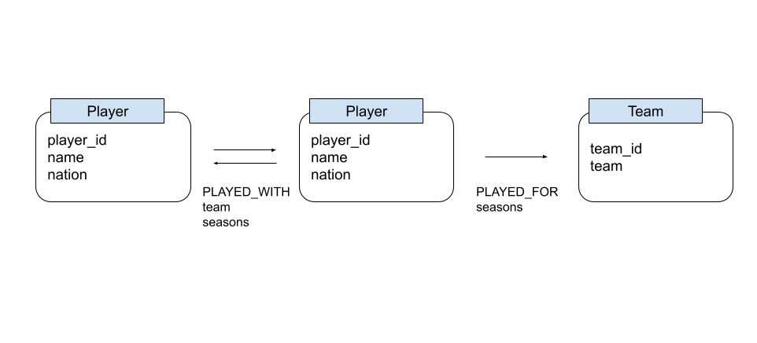

# NWSLink

NWSLink explores the club and teammate history of players in the National Women's Soccer League through Neo4j. This project uses [SoccerData](https://github.com/probberechts/soccerdata) tool to collect data from [FBref](https://fbref.com/en/).

## About the Dataset

### Schema



### Content

This dataset contains NWSL club history data for all players that received minutes during all official seasons (2013 to present). Therefore, rostered players that did not receive minutes in a given season are not included. It also does not include data from the 2020 season, as it was played as the NWSL Challenge Cup and NWSL Fall Series due to COVID-19 protocols. According to FBref, "Stats for the Challenge Cup and Fall Series are not counted toward league stats, per league determination."

## Loading the Dataset

This uses `pandas` and `numpy` packages.

### Install SoccerData

```
python3 -m pip install soccerdata
```

See SoccerData's [GitHub repo](https://github.com/probberechts/soccerdata) or [Quickstart guide](https://soccerdata.readthedocs.io/en/latest/intro.html) for more info.

### Download and Preprocess the Data

```
python3 preprocess.py
```

### Import to Neo4j

Initialize a Neo4j database

```
NEO4J_CONF=<absolute path to conf directory> neo4j console
```

Import data

```
NEO4J_CONF=<absolute path to conf directory> neo4j-admin database import full --nodes=Player="player_header.csv,players.csv" --nodes=Team="team_header.csv,teams.csv" --relationships=PLAYED_FOR="played_for_header.csv,played_for.csv" --relationships=PLAYED_WITH="played_with_header.csv,played_with.csv" --id-type=STRING --delimiter "\*"
```

Neo4j server ready for use. Re-run start command to set log-in and start using.

```
NEO4J_CONF=<absolute path to conf directory> neo4j console
```

## Uses

Visit [guide.md](/guide.md) for queries.
