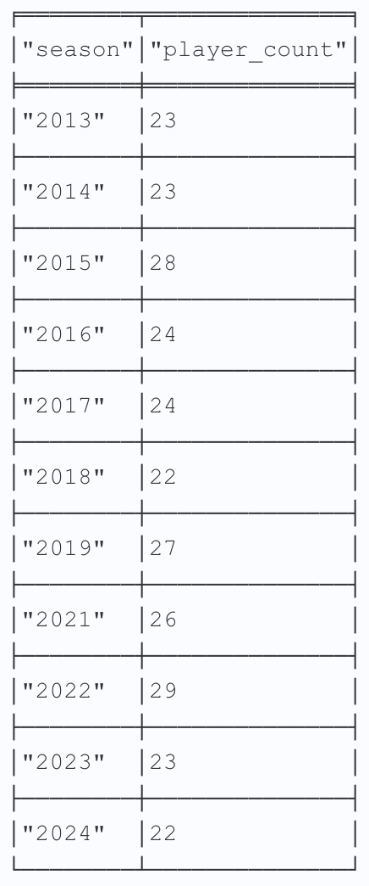

# Guide

Example queries made with Cypher.

**Table of Contents**

[Player Queries](#player-queries)

- [Teammates by Club](#teammates-by-club)
- [Amount of Teammates by Club](#amount-of-teammates-by-club)
- [Total Amount of Teammates](#total-amount-of-teammates)
- [Shortest Connection](#shortest-connection)
- [Players by Season and Club](#players-by-season-and-club)

[Club Queries](#club-queries)

- [Dispersal](#dispersal)
- [Players per Season](#players-per-season)

[League-Wide Stats](#league-wide-stats)

- [Most Teammates](#most-teammates)
- [League-Wide Players per Season](#league-wide-players-per-season)

## Player Queries

### Teammates by Club

Show all of Christen Press's teammates organized by club.

```
MATCH (p:Player {name: 'Christen Press'})-[f:PLAYED_FOR]->(t:Team)<-[a:PLAYED_FOR]-(m:Player)-[:PLAYED_WITH]->(p)
RETURN p, f, t, m, a ORDER BY t, m
```


### Amount of Teammates by Club

Provide the number of teammates Kristie Mewis played with per club.

```
MATCH (player:Player {name:"Kristie Mewis"})-[w:PLAYED_WITH]->(teammate:Player) RETURN w.team AS team, COUNT(w.team) AS num_teammates ORDER BY w.team
```


### Total Amount of Teammates

Provide the number of teammates Christine Sinclair played with.

```
MATCH (player:Player {name:"Christine Sinclair"})-[w:PLAYED_WITH]->(teammate:Player) WITH player, COUNT(DISTINCT teammate) AS num_teammates RETURN num_teammates
```


### Shortest Connection

This query uses Cypher's shortestPath() function, displaying teammate and/or club connections between players.

Show the shortest path between Savannah King and Ally Sentnor.

```
MATCH (a:Player),(b:Player)
WHERE a.name='Savannah King' AND b.name='Ally Sentnor'
MATCH p = shortestPath((a)-[*]-(b))
RETURN p
```


Show the shortest path between Sam Kerr and Jessica McDonald

```
MATCH (a:Player),(b:Player)
WHERE a.name='Sam Kerr' AND b.name='Jessica McDonald'
MATCH p = shortestPath((a)-[*]-(b))
RETURN p
```


### Players by Season and Club

Returns players that played for Washington Spirit in both the 2023 and 2024 seasons.

```
MATCH (p:Player)-[f:PLAYED_FOR WHERE f.seasons CONTAINS '2023' AND f.seasons CONTAINS '2024']->(t:Team {team:"Spirit"})

 RETURN p, f, t
```


## Club Queries

### Dispersal

Show where players from the Boston Breakers's 2017 season played in 2018.

Boston Breakers disbanded following the 2017 season, and the NWSL held a dispersal draft prior to the 2018 season.


Show where players from the Houston Dash's 2017 roster played in 2018.


### Players per Season

Show amount of active players by season

```
MATCH (t:Team {team:"Thorns"})<-[f:PLAYED_FOR]-(p:Player)
WITH REPLACE(REPLACE(REPLACE(f.seasons, "[", ""), "]", ""), "'", "") AS cleaned_seasons
WITH SPLIT(cleaned_seasons, ",") as seasons
UNWIND seasons as season
WITH TRIM(season) as individual_season
RETURN individual_season as season, COUNT(individual_season) as player_count ORDER BY season DESC
```



## League-Wide Stats

### Most Teammates

Show the top 10 players with the most amount of teammates.

```
MATCH (player:Player)-[w:PLAYED_WITH]->(teammate:Player) WITH player, COUNT(DISTINCT teammate) AS num_teammates RETURN player.name, num_teammates ORDER BY num_teammates DESC LIMIT 10
```


### League-Wide Players per Season

```
MATCH (t:Team)<-[f:PLAYED_FOR]-(p:Player)
WITH REPLACE(REPLACE(REPLACE(f.seasons, "[", ""), "]", ""), "'", "") AS cleaned_seasons
WITH SPLIT(cleaned_seasons, ",") as seasons
UNWIND seasons as season
WITH TRIM(season) as individual_season
RETURN individual_season as season, COUNT(individual_season) as player_count ORDER BY season
```


